# PSOC&trade; 4: MSCLP CSD slider with finger-type detection

This code example demonstrates the use of CAPSENSE&trade; middleware to detect both the finger-touch position and the finger-type detection (normal, fat, and large object) on a self-capacitance-based slider widget on a PSOC&trade; 4000T device using the multi-sense converter low-power (MSCLP) CAPSENSE&trade; block.

[View this README on GitHub.](https://github.com/Infineon/mtb-example-psoc4-msclp-csd-slider-finger-type-detection)

[Provide feedback on this code example.](https://yourvoice.infineon.com/jfe/form/SV_1NTns53sK2yiljn?Q_EED=eyJVbmlxdWUgRG9jIElkIjoiQ0UyNDI4NjMiLCJTcGVjIE51bWJlciI6IjAwMi00Mjg2MyIsIkRvYyBUaXRsZSI6IlBTT0MmdHJhZGU7IDQ6IE1TQ0xQIENTRCBzbGlkZXIgd2l0aCBmaW5nZXItdHlwZSBkZXRlY3Rpb24iLCJyaWQiOiJsb2hpdGFrc2gucmF3YXRAaW5maW5lb24uY29tIiwiRG9jIHZlcnNpb24iOiIxLjAuMCIsIkRvYyBMYW5ndWFnZSI6IkVuZ2xpc2giLCJEb2MgRGl2aXNpb24iOiJNQ0QiLCJEb2MgQlUiOiJJQ1ciLCJEb2MgRmFtaWx5IjoiUFNPQyJ9)


## Requirements

- [ModusToolbox&trade;](https://www.infineon.com/modustoolbox) v3.8 or later
- [ModusToolbox&trade; CAPSENSE&trade; and Multi-Sense Pack](https://softwaretools.infineon.com/tools/com.ifx.tb.tool.modustoolboxpackmultisense) for ModusToolbox&trade; v3.8 or later
- Board support package (BSP) minimum required version: 3.3.0
- Programming language: C
- Associated parts: [PSOC&trade; 4000T](https://www.infineon.com/002-33949)


## Supported toolchains (make variable 'TOOLCHAIN')

- GNU Arm&reg; Embedded Compiler v14.2.1 (`GCC_ARM`) – Default value of `TOOLCHAIN`

- Arm&reg; Compiler v6.22 (`ARM`)
- IAR C/C++ Compiler v9.50.2 (`IAR`)


## Supported kits (make variable 'TARGET')

- [PSOC&trade; 4000T CAPSENSE&trade; Prototyping Kit](https://www.infineon.com/CY8CPROTO-040T) (`CY8CPROTO-040T`) – Default `TARGET`


## Hardware setup

This example uses the board's default configuration. See the [Kit user guide](https://www.infineon.com/002-38600) to ensure that the board is configured correctly to use VDDA at 5 V.
 

## Software setup

See the [ModusToolbox&trade; tools package installation guide](https://www.infineon.com/ModusToolboxInstallguide) for information about installing and configuring the tools package.

This example requires no additional software or tools.


## Using the code example


### Create the project

The ModusToolbox&trade; tools package provides the Project Creator as both a GUI tool and a command line tool.

<details><summary><b>Use Project Creator GUI</b></summary>

1. Open the Project Creator GUI tool

   There are several ways to do this, including launching it from the dashboard or from inside the Eclipse IDE. For more details, see the [Project Creator user guide](https://www.infineon.com/ModusToolboxProjectCreator) (locally available at *{ModusToolbox&trade; install directory}/tools_{version}/project-creator/docs/project-creator.pdf*)

2. On the **Choose Board Support Package (BSP)** page, select a kit supported by this code example. See [Supported kits](#supported-kits-make-variable-target)

   > **Note:** To use this code example for a kit not listed here, you may need to update the source files. If the kit does not have the required resources, the application may not work

3. On the **Select Application** page:

   a. Select the **Applications(s) Root Path** and the **Target IDE**

      > **Note:** Depending on how you open the Project Creator tool, these fields may be pre-selected for you

   b. Select this code example from the list by enabling its check box

      > **Note:** You can narrow the list of displayed examples by typing in the filter box

   c. (Optional) Change the suggested **New Application Name** and **New BSP Name**

   d. Click **Create** to complete the application creation process

</details>


<details><summary><b>Use Project Creator CLI</b></summary>

The 'project-creator-cli' tool can be used to create applications from a CLI terminal or from within batch files or shell scripts. This tool is available in the *{ModusToolbox&trade; install directory}/tools_{version}/project-creator/* directory.

Use a CLI terminal to invoke the 'project-creator-cli' tool. On Windows, use the command-line 'modus-shell' program provided in the ModusToolbox&trade; installation instead of a standard Windows command-line application. This shell provides access to all ModusToolbox&trade; tools. You can access it by typing "modus-shell" in the search box in the Windows menu. In Linux and macOS, you can use any terminal application.

The following example clones the "[MSCLP low power CSD slider](https://github.com/Infineon/mtb-example-psoc4-msclp-low-power-csd-slider)" application with the desired name "MSCLP_Low_Power_CSD_Slider" configured for the *CY8CPROTO-040T* BSP into the specified working directory, *C:/mtb_projects*:

   ```
   project-creator-cli --board-id CY8CPROTO-040T --app-id mtb-example-psoc4-msclp-low-power-csd-slider --user-app-name MSCLP_Low_Power_CSD_Slider --target-dir "C:/mtb_projects"
   ```

The 'project-creator-cli' tool has the following arguments:

Argument | Description | Required/optional
---------|-------------|-----------
`--board-id` | Defined in the <id> field of the [BSP](https://github.com/Infineon?q=bsp-manifest&type=&language=&sort=) manifest | Required
`--app-id`   | Defined in the <id> field of the [CE](https://github.com/Infineon?q=ce-manifest&type=&language=&sort=) manifest | Required
`--target-dir`| Specify the directory in which the application is to be created if you prefer not to use the default current working directory | Optional
`--user-app-name`| Specify the name of the application if you prefer to have a name other than the example's default name | Optional

<br>

> **Note:** The project-creator-cli tool uses the `git clone` and `make getlibs` commands to fetch the repository and import the required libraries. For details, see the "Project creator tools" section of the [ModusToolbox&trade; tools package user guide](https://www.infineon.com/ModusToolboxUserGuide) (locally available at {ModusToolbox&trade; install directory}/docs_{version}/mtb_user_guide.pdf).

</details>


### Open the project

After the project has been created, you can open it in your preferred development environment.


<details><summary><b>Eclipse IDE</b></summary>

If you opened the Project Creator tool from the included Eclipse IDE, the project will open in Eclipse automatically.

For more details, see the [Eclipse IDE for ModusToolbox&trade; user guide](https://www.infineon.com/MTBEclipseIDEUserGuide) (locally available at *{ModusToolbox&trade; install directory}/docs_{version}/mt_ide_user_guide.pdf*).

</details>


<details><summary><b>Visual Studio (VS) Code</b></summary>

Launch VS Code manually, and then open the generated *{project-name}.code-workspace* file located in the project directory.

For more details, see the [Visual Studio Code for ModusToolbox&trade; user guide](https://www.infineon.com/MTBVSCodeUserGuide) (locally available at *{ModusToolbox&trade; install directory}/docs_{version}/mt_vscode_user_guide.pdf*).

</details>


<details><summary><b>Arm&reg; Keil&reg; µVision&reg;</b></summary>

Double-click the generated *{project-name}.cprj* file to launch the Keil&reg; µVision&reg; IDE.

For more details, see the [Arm&reg; Keil&reg; µVision&reg; for ModusToolbox&trade; user guide](https://www.infineon.com/MTBuVisionUserGuide) (locally available at *{ModusToolbox&trade; install directory}/docs_{version}/mt_uvision_user_guide.pdf*).

</details>


<details><summary><b>IAR Embedded Workbench</b></summary>

Open IAR Embedded Workbench manually, and create a new project. Then select the generated *{project-name}.ipcf* file located in the project directory.

For more details, see the [IAR Embedded Workbench for ModusToolbox&trade; user guide](https://www.infineon.com/MTBIARUserGuide) (locally available at *{ModusToolbox&trade; install directory}/docs_{version}/mt_iar_user_guide.pdf*).

</details>


<details><summary><b>Command line</b></summary>

If you prefer to use the CLI, open the appropriate terminal, and navigate to the project directory. On Windows, use the command-line 'modus-shell' program; on Linux and macOS, you can use any terminal application. From there, you can run various `make` commands.

For more details, see the [ModusToolbox&trade; tools package user guide](https://www.infineon.com/ModusToolboxUserGuide) (locally available at *{ModusToolbox&trade; install directory}/docs_{version}/mtb_user_guide.pdf*).

</details>


## Operation

1. Connect the board to your PC using a USB cable through the KitProg3 USB connector

2. Program the board using one of the following:

   <details><summary><b>Using Eclipse IDE</b></summary>

      1. Select the application project in the Project Explorer

      2. In the **Quick Panel**, scroll down, and click **\<Application Name> Program (KitProg3_MiniProg4)**
   </details>


   <details><summary><b>In other IDEs</b></summary>

   Follow the instructions in your preferred IDE
   </details>


   <details><summary><b>Using CLI</b></summary>

     From the terminal, execute the `make program` command to build and program the application using the default toolchain to the default target. The default toolchain is specified in the application's Makefile but you can override this value manually:
      ```
      make program TOOLCHAIN=<toolchain>
      ```

      Example:
      ```
      make program TOOLCHAIN=GCC_ARM
      ```
   </details>

3. After programming, the application starts automatically

   > **Note:** After programming, you may see the following error message if debug mode is disabled. Ignore the error or enable the debug mode to solve this error<br>

   ``` c
   "Error: Error connecting Dp: Cannot read IDR"
   ```

4. To test the application, slide your finger over the CAPSENSE&trade; slider and observe the LEDs. The LEDs also indicate the detected finger type (see **Table 1**). For a normal finger, LED2 stays OFF while LED3 shows the slider position. For a fat finger, LED2 blinks rapidly and for a large object, LED2 and LED3 turn ON at full (100%) brightness. This lets you confirm the finger-type detection feature in this code example

    **Table 1.  LED indication**

   | Finger type        | LED 2                 | LED 3                                   |
   |--------------------|-----------------------|-----------------------------------------|
   | Normal finger      | OFF                   | Brightness varies with position         |
   | Fat finger         | Fast blinking         | Brightness varies with position         |
   | Large object       | ON (100% brightness)  | ON (100% brightness)                    |


    > **Note:** After a large object is detected, remove the touch completely before trying again. The slider resumes normal operation only after the fat finger is removed    

You can also monitor the CAPSENSE&trade; data using the CAPSENSE&trade; Tuner application as follows:

### Monitor data using the CAPSENSE&trade; Tuner application

1. Open CAPSENSE&trade; Tuner from the tools section in the IDE **Quick Panel**

   You can also run the CAPSENSE&trade; Tuner application in standalone mode from *{ModusToolbox&trade; install directory}/ModusToolbox/tools_{version}/capsense-configurator/capsense-tuner*. In this case, after opening the application, select **File** > **Open** and open the *design.cycapsense* file of the respective application, which is present in the *{Application root directory}/bsps/TARGET_APP_\<BSP-NAME>/config/* folder

   See the [ModusToolbox&trade; user guide](https://www.infineon.com/ModusToolboxUserGuide) (locally available at *{ModusToolbox&trade; install directory}/docs_{version}/mtb_user_guide.pdf)* for options to open the CAPSENSE&trade; Tuner application using the CLI

2. Ensure that the kit is in CMSIS-DAP bulk mode (KitProg3 status LED is on and not blinking). See [Firmware-loader](https://github.com/Infineon/Firmware-loader) to learn how to update the firmware and switch modes in KitProg3

3. In the Tuner application, click on the **Tuner Communication Setup** icon or select **Tools** > **Tuner Communication Setup** 

4. In the **Tuner Communication Setup** window, select **I2C** under **KitProg3** and configure as follows:

    - **I2C address:** 8
    - **Sub-address:** 2 bytes
    - **Speed (kHz):** 400

    These are the same values set in the EZI2C resource

    **Figure 1. Tuner Communication Setup parameters**

     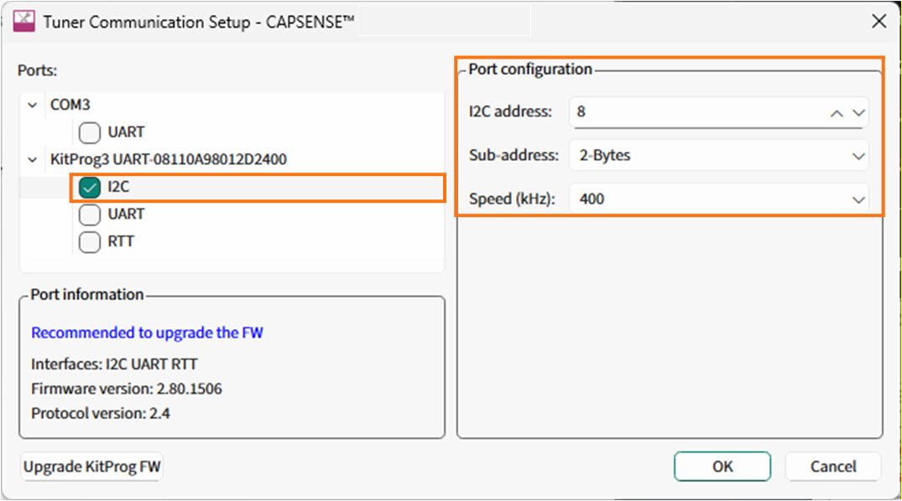
      <br>

5. Click **Connect** or select **Communication** > **Connect** to establish a connection

   **Figure 2. Establish a connection**

   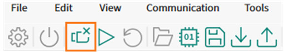

   <br>

6. Click **Start** or select **Communication** > **Start** to start data streaming from the device

   **Figure 3. Start tuner communication**

   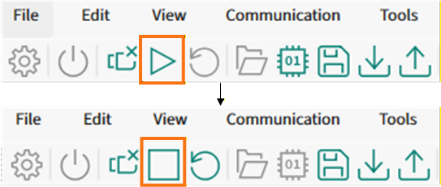

   The tuner displays the data from the sensor in the **Widget View**, **Graph View**, and **Touchpad View** tabs

7. Set **Read mode** to **Synchronized**. Navigate to the **Widget View** tab and observe that the **LinearSlider0** widget highlighted in blue color when touched. The CAPSENSE&trade; middleware classifies the touch-type based on the effective touch-zone width and the overall signal distribution across the active sensors

   **Figure 4. Finger detection in CAPSENSE&trade; Tuner (Widget View)**

   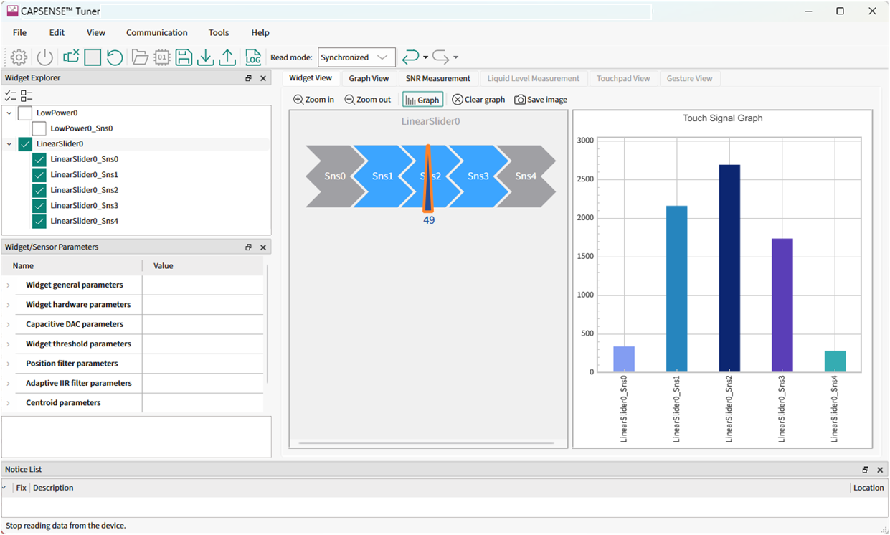

 <br>

8. In the **Graph View** tab, you can view the raw count, baseline, difference count, status for each sensor, and the slider position. For example, to view the sensor data for LinearSlider0, select **LinearSlider0_Sns0** under **LinearSlider0**

   **Figure 5. Graph View tab of the CAPSENSE&trade; Tuner**

   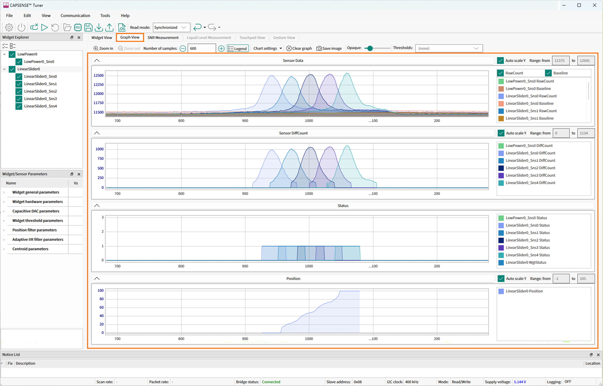

<br>   

9. See the **Widget/Sensor Parameters** section in the CAPSENSE&trade; Tuner window. The configuration parameters for each slider sensor element calculated by the CAPSENSE&trade; resource are displayed, as shown in **Figure 5**

10. Verify that the SNR is greater than 5:1 and the signal count is above 50 by following the steps given in [Stage 3:  Obtain noise and crossover point](https://github.com/Infineon/mtb-example-psoc4-msclp-low-power-csd-slider?tab=readme-ov-file#stage-3-obtain-noise-and-crossover-point)
     
    Non-reporting of false touches and the linearity of the position graph indicate proper tuning

> **Note:** See [PSOC&trade; 4: MSCLP low-power CSD button](https://github.com/Infineon/mtb-example-psoc4-msclp-low-power-csd-button) to observe the power state transitions, indicated by changing the blinking rate of an LED.

The Code Example also explains the scan time and process time measurements.


## Operation at other voltages

[CY8CPROTO-040T kit](https://www.infineon.com/CY8CPROTO-040T) supports operating voltages of 1.8 V, 3.3 V, and 5 V. See [Kit user guide](https://www.infineon.com/002-38600) to set the preferred operating voltage and see the section *setup the VDDA supply voltage and Debug mode*.

This application functionalities are optimally tuned for 5 V. However, basic functionalities works on other voltages. 

For better performance, it is recommended to tune the application for the preferred voltages.


## Tuning procedure

Follow the standard CSD slider tuning steps before enabling finger-type detection. See [PSOC&trade; 4: MSCLP low-power self-capacitance slider](https://github.com/Infineon/mtb-example-psoc4-msclp-low-power-csd-slider?tab=readme-ov-file#tuning-procedure) for Stage 1 to Stage 5.


Once these stages are completed, continue with the extended tuning flow given below to enable and tune the Finger-type detection feature.

Do the following to tune the slider widget:

- [Stage 6: Enable finger-type detection](#stage-6-enable-finger-type-detection)
- [Stage 7: Tune threshold parameters](#stage-7-Tune-threshold-parameters)


**Figure 6. CSD slider widget with finger-type detection feature tuning flow**

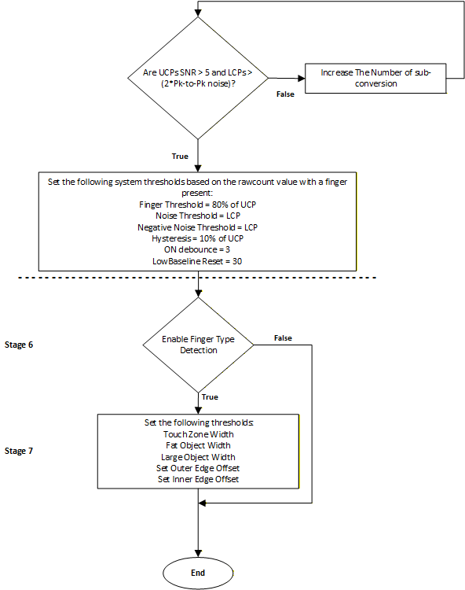


### Stage 6: Enable finger-type detection

1. Open **CAPSENSE&trade; Configurator** from the **Quick Panel**

2. Go to **Advanced** and then open **Widget Details** tab

3. select **LinearSlider0** from the left pane

4. Expand **Centroid Parameters**

5. Enable **Enable finger type detection**

6. Click **Save** 

See **Figure 7** for an example of enabling finger-type detection in the CAPSENSE&trade; Configurator.

**Figure 7. Enabling finger-type detection in CAPSENSE&trade; Configurator**

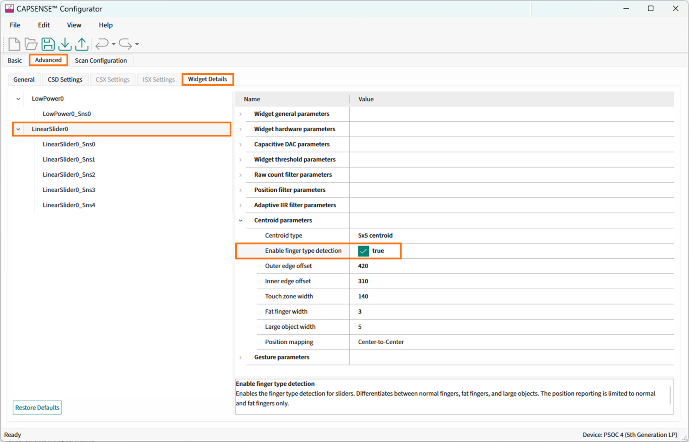

   <br>

After enabling finger-type detection, proceed to **Stage 7** to configure Fat object width, Large object width, Touch zone width and edge correction parameters.


### Stage 7: Tune threshold parameters

After enabling finger type detection in Stage 6, configure the thresholds that determine the firmware classifies normal, fat, and large-object touches and the slider position is corrected near the edges. These settings are located under **Advanced > Widget > LinearSlider0 > Centroid Parameters** in the CAPSENSE&trade; Configurator.

**Figure 8. Parameter tuning flow**

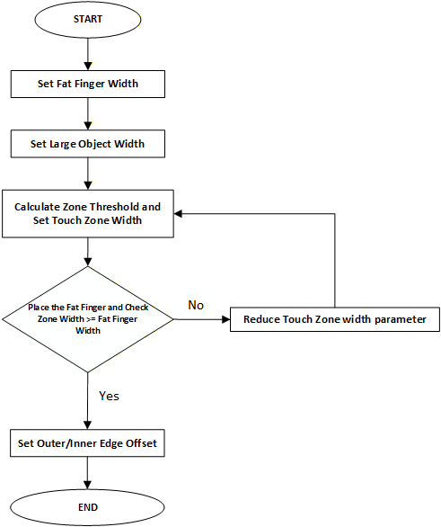

Tune the parameters according to the above tuning flow to ensures that the middleware determines the correct touch as normal, fat, or large object before applying any edge position correction.


   **Table 2.  Software tuning parameters**

   | Parameter                 |   CY8CPROTO-040T      |
   |---------------------------|-----------------------|
   | Touch zone width          |        140            |
   | Fat finger width          |        3              |
   | Large object width        |        5              |
   | Outer edge offset         |        420            |
   | Inner edge offset         |        310            |
   
### 1.   Fat finger width

Fat finger width sets the minimum number of adjacent slider sensors that must be active before a touch can be treated as a fat finger (wide touch). A value of 3 works well on this kit because a wider fingertip often activates about three sensors at once, helping reliable detection. **Figure 9** shows an example of a fat finger displayed in the widget view of the CAPSENSE&trade; Tuner.

### Steps to tune the fat finger detection

   1. Start with fat finger width = 3 (for a sensor slider)
   2. In the CAPSENSE&trade; Tuner, touch the slider with a normal finger and see how many adjacent sensors light up together
   3. Touch again with a wider finger contact and see how many sensors light up
   4. Adjust the value:T
   
      - If normal finger is detected as fat finger, increase fat finger width (example: 3 to 4)
      - If wide touch is not detected as fat finger, decrease fat finger width (example: 4 to 3)
   
   **Figure 9. Fat finger**

   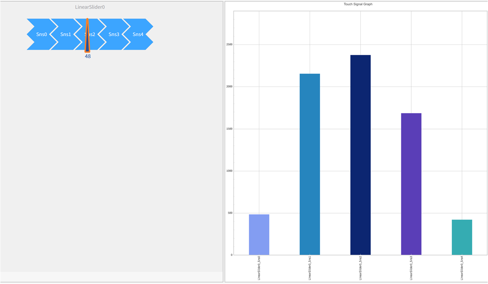

### 2. Large object width

Large object width sets the minimum number of adjacent slider sensors that must be active at the same time before the touch is classified as a large object (for example, a palm). in other words, the touch covers a very wide area of the slider, the system treats it as a large object instead a of a finger.

A value of 5 works well for the CYPROTO-040T kit because it matches the full width of the 5-sensor slider that cover almost the entire slider are treated as a large object. **Figure 10** displays an example of a large object will be displayed in **Widget View** in the CAPSENSE&trade; Tuner.

**Figure 10. Large object**

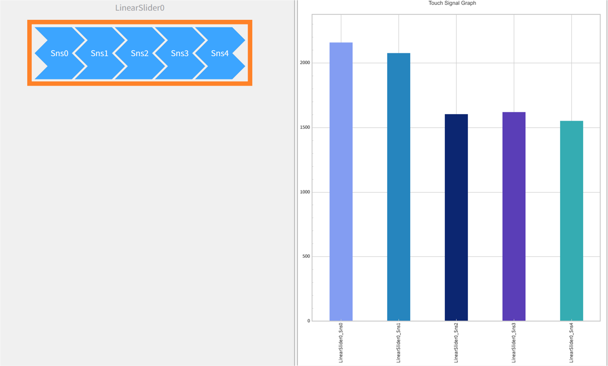


### 3.   Touch zone width

Touch zone width controls how many neighboring slider sensor are grouped as one touch. A value of 140 provides a good balance of smooth movement and stable detection on the 5‑sensor CY8CPROTO‑040T slider. This is informally the first parameter to tune, because the touch zone is used by all touch-type decisions. **Figure 11** displays an example of the touch zone available on the CY8CPROTO‑040T kit. 
   
**Figure 11. Touch zone width**

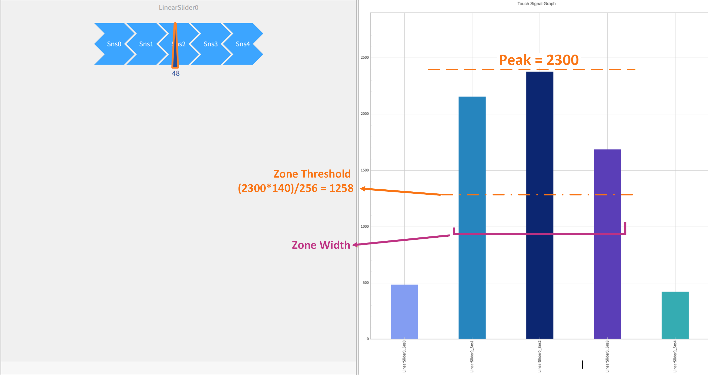

<br>

### Why we start with touch zone width = 140?

We use 140 as a practical starting value on a 5-segment slider because it typically groups only the strongest neighbors, which gives smooth position tracking without adding extra jitter. After setting 140, we verify in CAPSENSE&trade; Tuner that there are no false touches and the position graph looks linear.


### Steps to calculate the Touch zone width

A neighboring sensor is included in the touch zone only if its signal is above a fraction of the peak:

Zone threshold = Peak signal x (Touch zone width/256)

As shown in **Figure 11**:

  - Touch zone width = 140
   
  - Effective Touch zone width = 140/256 = 0.546875

Sensors whose signal exceeds the threshold (~55% of the peak) are grouped into the same touch zone. In this example, Sns1–Sns3 form a 3-sensor touch zone.

  - Peak = 2300
   
  - Zone threshold = 2300 × 0.546875 ≈ 1258
   
So, any sensor above ~1258 is included in the touch zone.

> **Note:** When adjusting these settings, make sure the Fat Finger Width Threshold is always less than the Touch Zone Width. This ensures the algorithm has enough active neighboring sensor within the touch zone to correctly recognize a wide (fat) finger. For example, in this setup the fat finger width is set to 3.


### Steps to tune the Touch zone width

   1. Open CAPSENSE&trade; Tuner and go to the slider **Widget View**
   
   2. Touch the slider with a normal finger and identify the peak bar (highest bar)
   
   3. Use the approach shown in **Figure 11**:
   
      - Calculate the Zone Threshold = Peak × TouchZoneWidth / 256
      - Sensors with bars above this line are included in the touch zone
  
   4. Adjust the Touch zone width and re-check:
   
      - If too many sensors are included (zone looks too wide), increase Touch zone width (neighbors must be stronger to be included)
      - If only the peak sensor is included (zone looks too narrow and movement feels “steppy”), decrease Touch zone Width (neighbors are easier to include)
  
   5. Repeat at left, center, and right positions and confirm the touch zone stays consistent
  
> **Note:** If Touch zone width is not tuned correctly, the touch zone can become too narrow or too wide, and touch classification may be inconsistent. In your **Figure 11**, the threshold creates a 3-sensor touch zone (Sns1–Sns3), which is a typical and stable result for a normal finger on a 5-sensor slider.


### Selecting position mapping

Position mapping defines how the slider’s final position value is scaled across the entire length of the slider. This setting determines how the minimum and maximum positions correspond to the physical sensors on the slider. It should be configured before tuning Inner edge offset and Outer edge Offset, because those corrections depend on how the slider endpoints are defined.

The Position Mapping supports two options:

 - Center-to-Center – The minimum position is mapped to the center of the first sensor, and the maximum position is mapped to the center of the last sensor
 - Edge-to-Edge – The minimum position is mapped to the left edge of the first sensor, and the maximum position is mapped to the right edge of the last sensor

Selecting the correct method ensures that the reported slider position aligns with the physical slider layout and that edge-offset tuning is applied on the correct position scale.

   **Figure 12. Understanding slider edges for edge Offset**

   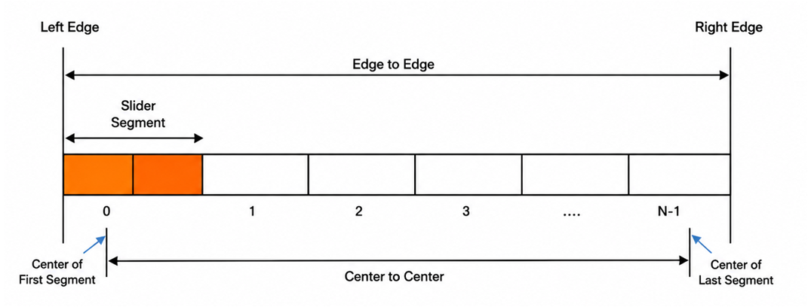


### 4. Outer edge offset

Outer edge offset improves slider accuracy at the physical ends of the slider. It applies a correction when the touch peak occurs on the outermost sensors (index 0 or N‑1). At the slider edges, only one neighboring sensor contributes to the position calculation. This can make the reported position slightly compressed toward the center. The Outer edge offset corrects this, so the slider position reaches the true edges smoothly.

For the CY8CPROTO-040T 5-sensor slider, the tuned value used is 420.


   **Figure 13. Outer edge**

   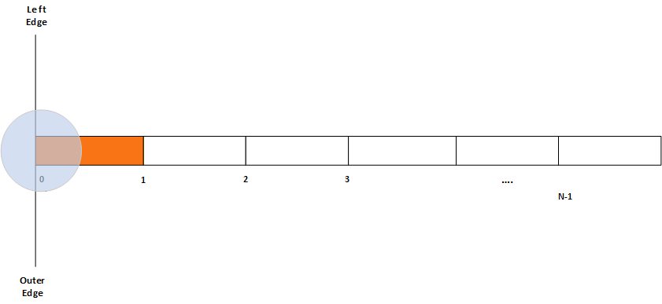

   As shown in **Figure 13**, the physical ends of the slider are at the left edge and right edge, while the first and last sensors are centered slightly inside those ends (segment 0 and segment N‑1). Due to this, the position graph can feel jumped near the both ends. The Outer edge offset helps correct this end effect, so the position graph starts changing smoothly at the left end and reaches 100% smoothly at the right end, improving the linearity of the position graph in CAPSENSE&trade; Tuner.

   ### Steps to tune the Outer edge offset

   1. Start with the default value (399) and open CAPSENSE&trade; Tuner
   
   2. Go to **Graph View** tab and observe the position graph
   
   3. Using a grounded metal finger, swipe slowly at a constant speed from left to right, and then from right to left
   
   4. Focus only on the first and last ~10% to 15% of the position range:
   
      - Left end (near 0%)
      - Right end (near 100%)
  
   5. Adjust the Outer edge offset in small steps (for example ±10) and click **Apply to Device** each time
   
      - If the position stays flat near 0%/100% for too long (flat zone), increase the Outer edge offset (example: 250 to 270 to 290)
      - If the position jumps too quickly to higher values near the ends (too “aggressive”), decrease the Outer edge offset (example: 300 to 280)

   6. Repeat the swipe test until the position curve looks smooth and linear at both the ends. The code example states that the linearity of the position graph (and no false jumps) indicates proper tuning. 


### 5.   Inner edge offset

   Inner edge offset improves the transition between the outer sensors (Sns0 or Sns4) and the center region. A default value of 310 smooths the centroid calculation to ensure a continuous slope between edges and core regions when the peak is on Sns1 or Sns3, reducing small steps in the position graph. 

   **Figure 14. Inner edge**

   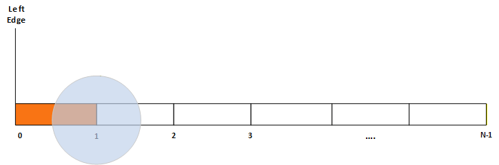

   As shown in **Figure 12**, the slider is made of segments from 0 to N-1. The inner-edge segments are the ones next to the ends (segment 1 and segment N-2). Inner edge offset helps the position output change smoothly in these areas, so you don’t see a small jump in the Position graph when your finger moves from the end segment into the middle of the slider. Proper tuning is indicated by a smooth and linear position graph (and no false touches) in CAPSENSE&trade; Tuner.

 ### Steps to tune the Inner edge offset

   1. With the existing default value of 290, power up the kit and open CAPSENSE&trade; Tuner
   
   2. Navigate to the **Graph View** tab and observe the position graph

   3. Using a grounded metal finger, swipe slowly at constant speed from left to right and then from right to left 
   
   4. Focus on the transition regions just inside the ends (typically around 10% to 30% and 70% to 90% of the position range), where the peak shifts between:
   
      - Sensor 0 to Sensor 1 (left side transition)
      - Sensor N‑2 to Sensor N‑1 (right side transition)
  
   5. Adjust the Outer edge offset in small steps (for example ±10) and click **Apply to Device** each time
   
      - If you see a step or a sudden change in the slope near the inner-edge regions, increase the Inner edge offset (example: 200 to 210 to 220)
      - If the position curve near those regions becomes too “rounded” or shows a bump, decrease the Inner edge offset (example: 230 to 220)
  
   6. Repeat the swipe test until the position curve looks smooth and linear through these inner-edge transition regions. The code example states that the linearity of the position graph (and no false touches) indicates proper tuning


### Finger stability with the slider

Finger-type detection happens in three-steps, building on the *Touch zone width* concept described in **Section 3: Touch zone width** (see **Figure 11**, showing the peak, zone threshold, and which sensors are included in the zone).

### Step 1: Build the touch zone

First, the algorithm finds the peak sensor (highest signal). Then it forms a touch zone around that peak by including neighboring sensors whose signal is above the zone threshold (a fraction of the peak, as shown in the **Figure 11**).

### Step 2: Measure the zone width 

Once the touch zone is formed, the algorithm measures the zone width, defined as the number of contiguous sensors included in the touch zone (i.e., the sensors that passed the zone-threshold). This is a measured value (in sensors), and it can change slightly as the finger moves or pressure changes. Touch zone width is a configuration setting; zone width is the measured number of sensors included for this touch.

### Step 3: Decide finger type (normal, fat, or large)

The slider then classifies the touch as normal, fat, or large object using the measured zone width from **Step 2**.

Because the measured zone width can fluctuate slightly near a boundary, the algorithm applies a small stability (hysteresis) band around the fat and large thresholds. Inside this range, the system keeps the previous finger type instead of switching immediately. This prevents flickering when the width is close to a threshold.

**Table 3** shows the finger-type transitions based on the measured zone width (in sensors) and the previously detected finger type.

**Table 3. Finger-type transition table**  
*(Width = measured zone width, i.e., number of contiguous sensors included in the touch zone)*

| Zone width (sensors)  | Previous: None | Previous: Normal | Previous: Fat | 
|-----------------------|----------------|------------------|---------------|
| 1                     | Normal         | Normal           | Normal        | 
| 2                     | Normal         | Normal           | Fat           | 
| 3                     | Fat            | Normal           | Fat           | 
| 4                     | Fat            | Fat              | Fat           | 
| 5                     | Large          | Fat              | Fat           | 


## Tuning parameters

This code example has the tuning flow explained for the CSD slider widget which supports finger-type detection feature. See CE238886 [PSOC&trade; 4: MSCLP Low Power CSD Button](https://github.com/Infineon/mtb-example-psoc4-msclp-low-power-csd-button) for tuning the low-power widget.


### Apply the settings to the firmware

1. Click **Apply to Device** and **Apply to Project** in the CAPSENSE&trade; Tuner window to apply the settings to the device and project, respectively. Close the Tuner

   **Figure 15. Apply to project**

   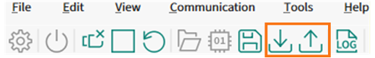

   The change is updated in the *design.cycapsense* file and reflected in the CAPSENSE&trade; Configurator

<br>

## Debugging

The user can debug the example to step through the code.

<details><summary><b>In Eclipse IDE</b></summary>

Use the **\<Application Name> Debug (KitProg3_MiniProg4)** configuration in the **Quick Panel**. For details, see the "Program and debug" section in the [Eclipse IDE for ModusToolbox&trade; user guide](https://www.infineon.com/MTBEclipseIDEUserGuide).

</details>


<details><summary><b>In other IDEs</b></summary>

Follow the instructions in your preferred IDE.
</details>


## Design and implementation

The project contains a slider widget configured in CSD-RM sensing mode. See the [Tuning procedure](#tuning-procedure) section for step-by-step instructions to configure the other settings of the CAPSENSE&trade; Configurator.

The project uses the [CAPSENSE&trade; middleware](https://github.com/Infineon/capsense) (see ModusToolbox&trade; user guide for more details on selecting a middleware). See [AN85951 – PSOC&trade; 4 and PSOC&trade; 6 MCU CAPSENSE&trade; design guide](https://www.infineon.com/AN85951) for more details on CAPSENSE&trade; features and usage.

The [ModusToolbox&trade;](https://www.infineon.com/modustoolbox) provides a GUI-based tuner application for debugging and tuning the CAPSENSE&trade; system. The CAPSENSE&trade; Tuner application works with EZI2C and UART communication interfaces. This project has an SCB block configured in EZI2C mode to establish communication with the onboard KitProg, which in turn enables reading the CAPSENSE&trade; raw data by the CAPSENSE&trade; Tuner. 

The CAPSENSE&trade; data structure that contains the CAPSENSE&trade; raw data is exposed to the CAPSENSE&trade; Tuner by setting up the I2C communication data buffer with the CAPSENSE&trade; data structure. This enables the tuner to access the CAPSENSE&trade; raw data for tuning and debugging CAPSENSE&trade;.

To test the application, slide the user's finger over the CAPSENSE&trade; slider and observe the LEDs. LED3 turns ON when a touch is detected and turns OFF when the user lifts the finger; for normal touches, LED3 brightness increases when swiping from left to right to indicate the slider position. The LEDs also indicate the detected touch type: for a normal finger, LED2 remains OFF; for a fat finger, LED2 blinks rapidly; and for a large object, LED2 and LED3 turn ON at full (100%) brightness, allowing the user to confirm finger-type detection in this code example.

The PWM pins are used to control LED brightness and to generate the LED2 blink pattern, as well as ON/OFF operation of LED2 and LED3.

### Steps to set up the VDDA supply voltage in Device Configurator

1. Open Device Configurator from the **Quick Panel**

2. Navigate to the **System** tab, select the **Power** resource and set the VDDA value under **Operating Conditions**, as shown in **Figure 16**

   **Figure 16. Setting the VDDA supply in the System tab of Device Configurator**

   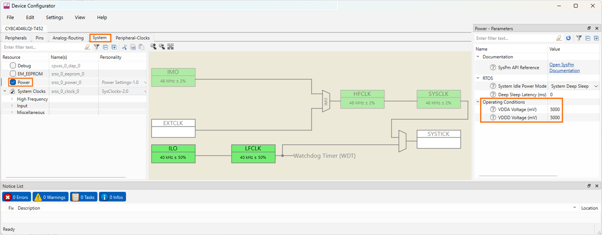

   <br>

3. By default, Debug mode is disabled for this application to reduce power consumption. Enable the Debug mode to enable the SWD pins, as shown in **Figure 17**

   **Figure 17. Enable debug mode in the System tab of Device Configurator**

   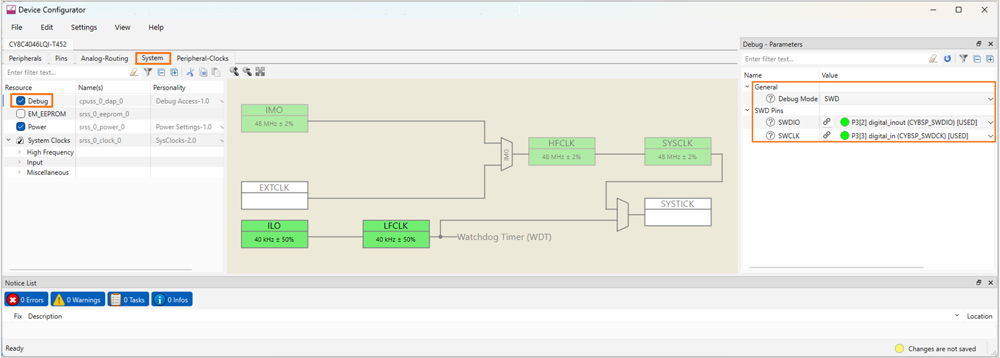

<br>

## Resources and settings

   **Figure 18. EZI2C settings**

   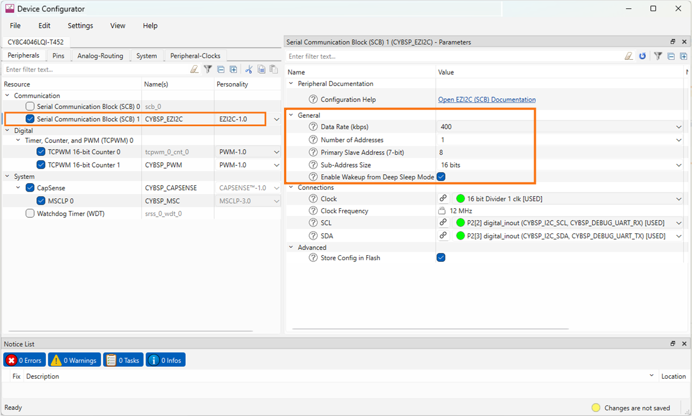

   <br>

   **Figure 19. PWM settings**

   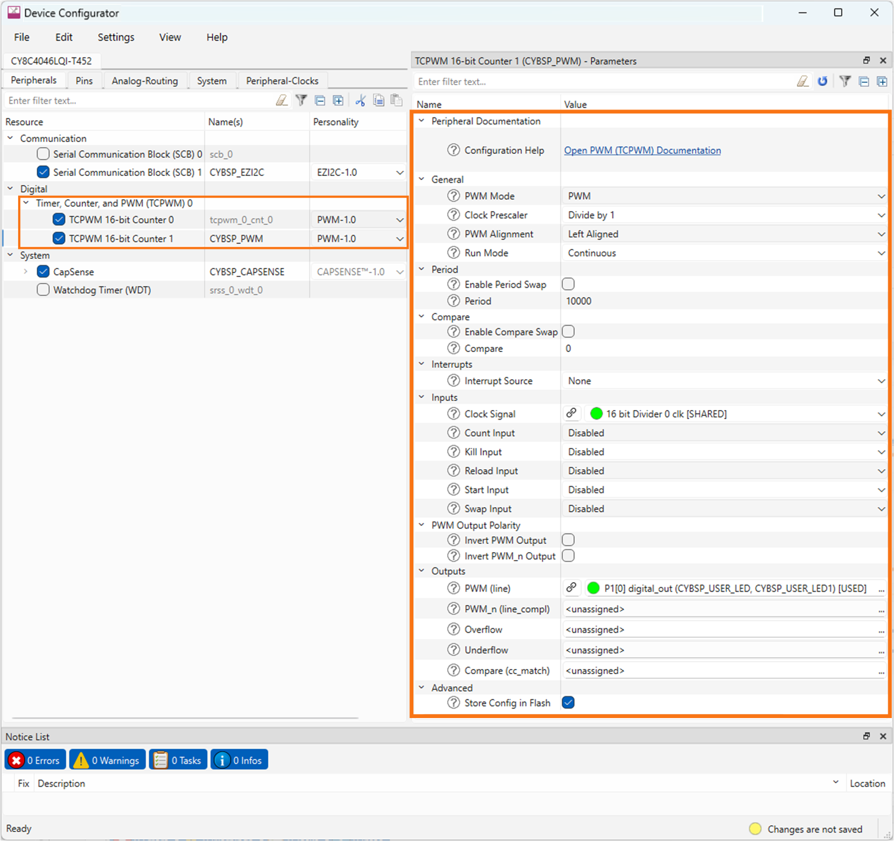

   <br>


> **Note:** If a constraint warning occurs, use the suggested fix to set the LED2 pin drive mode to Strong Drive, input buffer off, as PWM output requires a digital output drive mode. If  the pin remains in Analog High-Z (default) mode, the PWM wil not function correctly for LED2.

   <br>


   **Table 4. Application resources**

   Resource  |  Alias/object     |    Purpose     
   ----------|----------------    | :------------ 
   SCB (EZI2C) (PDL)    |     CYBSP_EZI2C    |     EZI2C slave driver to communicate with CAPSENSE&trade; Tuner 
   CAPSENSE&trade;      |     CYBSP_MSC      |     CAPSENSE&trade; driver to interact with the MSCLP hardware and interface the CAPSENSE&trade; sensors 
   TCPWM PWM (LED3)     |     CYBSP_PWM      |     Controls LED3 brightness to indicate slider touch and position
   TCPWM PWM (LED2)     |     tcpwm_0_cnt_0  |     LED2 indication for finger-type detection (OFF for normal, fast blink for fat finger, ON 100% for large object) 

<br>


## Firmware flow

   **Figure 20. Firmware flowchart**

   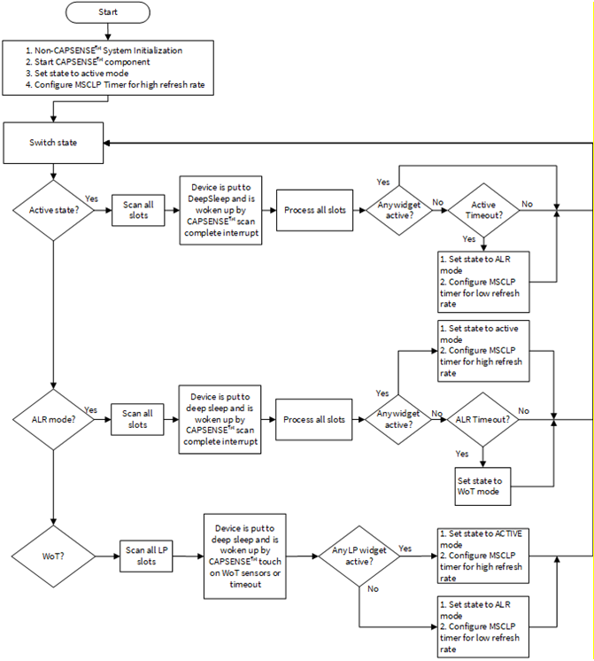

   <br>

## Related resources

Resources  | Links
-----------|----------------------------------
Application notes  | [AN79953](https://www.infineon.com/AN79953) – Getting started with PSOC&trade; 4 <br> [AN85951](https://www.infineon.com/AN85951) – PSOC&trade; 4 and PSOC&trade; 6 MCU CAPSENSE&trade; design guide <br> [AN234231](https://www.infineon.com/AN234231) - PSOC&trade; 4 CAPSENSE&trade; ultra-low-power capacitive sensing techniques
Code examples  | [Using ModusToolbox&trade;](https://github.com/Infineon/Code-Examples-for-ModusToolbox-Software) on GitHub
Device documentation | [PSOC&trade; 4 datasheets](https://www.infineon.com/cms/en/search.html#!term=psoc%204%20datasheet&view=all) <br>[PSOC&trade; 4 technical reference manuals](https://www.infineon.com/cms/en/search.html#!term=psoc%204%20TRM&view=all)
Development kits | Select your kits from the [Evaluation board finder](https://www.infineon.com/cms/en/design-support/finder-selection-tools/product-finder/evaluation-board)
Libraries on GitHub  | [mtb-hal-cat2](https://github.com/Infineon/mtb-hal-cat2) – Hardware Abstraction Layer (HAL) library
Middleware on GitHub | [CAPSENSE&trade; Middleware Library](https://github.com/Infineon/capsense) – CAPSENSE&trade; library and documents <br>
Tools  | [ModusToolbox&trade;](https://www.infineon.com/modustoolbox) – ModusToolbox&trade; software is a collection of easy-to-use libraries and tools enabling rapid development with Infineon MCUs for applications ranging from wireless and cloud-connected systems, edge AI/ML, embedded sense and control, to wired USB connectivity using PSOC&trade; Industrial/IoT MCUs, AIROC&trade; Wi-Fi and Bluetooth&reg; connectivity devices, XMC&trade; Industrial MCUs, and EZ-USB&trade;/EZ-PD&trade; wired connectivity controllers. ModusToolbox&trade; incorporates a comprehensive set of BSPs, HAL, libraries, configuration tools, and provides support for industry-standard IDEs to fast-track your embedded application development

<br>


## Other resources

Infineon provides a wealth of data at [www.infineon.com](https://www.infineon.com) to help you select the right device, and quickly and effectively integrate it into your design.


## Document history

Document title: *CE242863* - *PSOC&trade; 4: MSCLP CSD slider with finger-type detection*

 Version | Description of change
 ------- | ---------------------
 1.0.0   | New code example
  
 <br>


All referenced product or service names and trademarks are the property of their respective owners.

The Bluetooth&reg; word mark and logos are registered trademarks owned by Bluetooth SIG, Inc., and any use of such marks by Infineon is under license.

PSOC&trade;, formerly known as PSoC&trade;, is a trademark of Infineon Technologies. Any references to PSoC&trade; in this document or others shall be deemed to refer to PSOC&trade;.


---------------------------------------------------------

(c) 2026, Infineon Technologies AG, or an affiliate of Infineon Technologies AG. All rights reserved.

This software, associated documentation and materials ("Software") is owned by Infineon Technologies AG or one of its affiliates ("Infineon") and is protected by and subject to worldwide patent protection, worldwide copyright laws, and international treaty provisions. Therefore, you may use this Software only as provided in the license agreement accompanying the software package from which you obtained this Software. If no license agreement applies, then any use, reproduction, modification, translation, or compilation of this Software is prohibited without the express written permission of Infineon.
<br>
Disclaimer: UNLESS OTHERWISE EXPRESSLY AGREED WITH INFINEON, THIS SOFTWARE IS PROVIDED AS-IS, WITH NO WARRANTY OF ANY KIND, EXPRESS OR IMPLIED, INCLUDING, BUT NOT LIMITED TO, ALL WARRANTIES OF NON-INFRINGEMENT OF THIRD-PARTY RIGHTS AND IMPLIED WARRANTIES SUCH AS WARRANTIES OF FITNESS FOR A SPECIFIC USE/PURPOSE OR MERCHANTABILITY. Infineon reserves the right to make changes to the Software without notice. You are responsible for properly designing, programming, and testing the functionality and safety of your intended application of the Software, as well as complying with any legal requirements related to its use. Infineon does not guarantee that the Software will be free from intrusion, data theft or loss, or other breaches (“Security Breaches”), and Infineon shall have no liability arising out of any Security Breaches. Unless otherwise explicitly approved by Infineon, the Software may not be used in any application where a failure of the Product or any consequences of the use thereof can reasonably be expected to result in personal injury.
